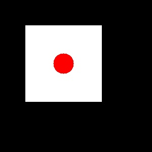
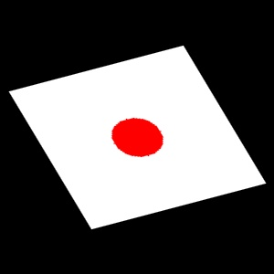

在计算机视觉和图像处理的世界里，经常需要对图像进行旋转、缩放、平移或者校正。这些操作背后核心的数学概念，就是**仿射变换 (Affine Transformation)**。

## 1. 什么是仿射变换

用最简单的话来说，仿射变换就是**“线性变换 + 平移”**。

想象有一个图像：

1.  可以**拉伸**它（缩放）。
2.  可以**旋转**它。
3.  可以**平移**它（移动位置）。
4.  可以**错切**它（Shear，把它压扁成平行四边形）。

无论如何折腾，仿射变换都有一个雷打不动的**“黄金法则”**：

>   **原图中平行的直线，变换后依然保持平行。**

## 2. 数学原理

在二维平面上，将一个像素点 $(x, y)$ 移动到新位置 $(x', y')$。

数学上，这可以通过一个 **$2 \times 3$ 的矩阵** 来描述：

$$A = \begin{bmatrix} a_{11} & a_{12} & b_1 \\ a_{21} & a_{22} & b_2 \end{bmatrix}$$

运算公式如下：

$$\begin{bmatrix} x' \\ y' \end{bmatrix} = \begin{bmatrix} a_{11} & a_{12} \\ a_{21} & a_{22} \end{bmatrix} \begin{bmatrix} x \\ y \end{bmatrix} + \begin{bmatrix} b_1 \\ b_2 \end{bmatrix}$$

-   **左边的 $2 \times 2$ 部分** $(a_{ij})$：负责旋转、缩放和错切。
-   **右边的 $2 \times 1$ 部分** $(b_i)$：负责平移（移动距离）。

在 OpenCV 中，一切操作本质上都是在这个矩阵上做文章。

## 3. OpenCV 实现

下面使用 Python 的 `opencv-python` 库来演示。

### 3.0 准备工作

首先确保安装了必要的库：

```
pip install opencv-python matplotlib numpy
```

接着将创建一张简单的图来进行演示。

```python
import cv2
import numpy as np
import matplotlib.pyplot as plt

# 创建一个简单的黑色背景图，画一个白色的矩形
img = np.zeros((300, 300, 3), dtype=np.uint8)
cv2.rectangle(img, (50, 50), (200, 200), (255, 255, 255), -1)
cv2.circle(img, (125, 125), 20, (0, 0, 255), -1) # 加个红点方便看方向

def show_img(title, image):
    plt.figure(figsize=(5,5))
    plt.title(title)
    # OpenCV是BGR，Matplotlib是RGB，需要转换
    plt.imshow(cv2.cvtColor(image, cv2.COLOR_BGR2RGB))
    plt.axis('off')
    plt.show()

show_img("Original Image", img)
cv2.imwrite('1-original-img.jpg', img)
```



### 3.1 平移 (Translation)

平移是最简单的仿射变换。只需要指定 $x$ 方向移动 $t_x$， $y$ 方向移动 $t_y$。

构造的矩阵如下：

$$M = \begin{bmatrix} 1 & 0 & t_x \\ 0 & 1 & t_y \end{bmatrix}$$

```python
# 向右移动 50 像素，向下移动 30 像素
tx, ty = 50, 30

# 定义平移矩阵 (注意数据类型必须是 float32)
M_translate = np.float32([[1, 0, tx], 
                          [0, 1, ty]])

# 使用 cv2.warpAffine 应用变换
# 参数: (输入图像, 变换矩阵, 输出图像大小)
rows, cols = img.shape[:2]
img_translated = cv2.warpAffine(img, M_translate, (cols, rows))

show_img("After translation", img_translated)
cv2.imwrite('2-after-translation.jpg', img_translated)
```


### 3.2 旋转 (Rotation)

旋转稍微复杂一点，因为涉及到 $\cos$ 和 $\sin$。但 OpenCV 提供了一个非常贴心的辅助函数 `cv2.getRotationMatrix2D`，不仅可以处理旋转，还能同时处理缩放。

```python
# 定义旋转中心 (通常是图像中心)
center = (cols // 2, rows // 2)
angle = 45  # 逆时针旋转 45 度
scale = 0.8 # 缩小为原来的 0.8 倍

# 获取旋转矩阵 (2x3 矩阵)
M_rotate = cv2.getRotationMatrix2D(center, angle, scale)

img_rotated = cv2.warpAffine(img, M_rotate, (cols, rows))

show_img("After rotation", img_rotated)
cv2.imwrite('3-after-rotation.jpg', img_rotated)
```


### 3.3 终极奥义：三点法 (Three Points)

这是仿射变换最强大的地方。

假设不知道具体的旋转角度或缩放比例，但知道 **“变换前图片上的三个点，在变换后应该去哪里”**。

因为仿射变换由 6 个参数决定（矩阵里的 6 个数），而每对点提供 2 个方程，所以我们需要 **3 对点** 就能解出这个矩阵。

```python
# 1. 定义原图中的三个点 (左上角, 右上角, 左下角)
pts1 = np.float32([[50, 50], [200, 50], [50, 200]])

# 2. 定义这三个点希望变换到的位置
# 比如：让它们稍微倾斜一点
pts2 = np.float32([[10, 100], [200, 50], [100, 250]])

# 3. 让 OpenCV 帮我们计算矩阵
M_affine = cv2.getAffineTransform(pts1, pts2)

# 4. 应用变换
img_affine = cv2.warpAffine(img, M_affine, (cols, rows))

show_img("Affine transformation based on three points", img_affine)
cv2.imwrite('4-after-affine.jpg', img_affine)
```



## 4. 总结

仿射变换是图像处理的基础工具。总结以下关键点：

1.  **核心特征**：平行的线变换后依然平行。
2.  **核心工具**：`cv2.warpAffine` 函数。
3.  **两种方法**：
    -   **手动构造矩阵**：用于简单的平移。
    -   **辅助函数**：用 `getRotationMatrix2D` 处理旋转，用 `getAffineTransform` (三点法) 处理复杂的几何校正。

掌握了仿射变换，就掌握了控制图像几何形态的钥匙。

