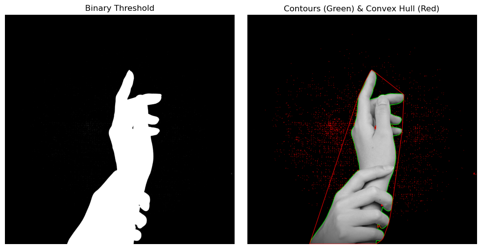

```
title: 手部轮廓与凸包检测
description: 使用 OpenCV 进行图像二值化、轮廓提取以及利用“橡皮筋原理”计算凸包的相关实现。
publishDate: 2025-12-08
```

在计算机视觉的手势识别、物体抓取等任务中，准确地提取目标轮廓是至关重要的第一步。下面通过一段简短的 Python 代码，来拆解 OpenCV 中三个非常基础但强大的概念：

1. 阈值处理 (Thresholding)
2. 轮廓提取 (Contours)
3. 凸包 (Convex Hull)

下面这段代码涵盖了图像形态学分析的一条完整流水线：读取 -> 二值化 (简化) -> 轮廓 (定位) -> 凸包 (特征抽象)。


```python
import cv2
import numpy as np
import matplotlib.pyplot as plt

def process_hand_convex_hull(image_path):
    # 1. Load the image in grayscale
    # Using flag 0 for grayscale mode
    gray_image = cv2.imread(image_path, 0)

    # Check if image was loaded successfully
    if gray_image is None:
        print(f"Error: Could not load image from {image_path}. Please check the path.")
        return

    # 2. Preprocessing: Apply Binary Thresholding
    # Pixels darker than 10 become 0, brighter become 255. 
    # Note: '10' is a very low threshold, assuming a dark background.
    ret, binary_thresh = cv2.threshold(gray_image, 10, 255, cv2.THRESH_BINARY)

    # 3. Find Contours
    # RETR_TREE retrieves all contours and reconstructs a full hierarchy of nested contours.
    # CHAIN_APPROX_SIMPLE compresses horizontal, vertical, and diagonal segments (saves memory).
    contours, hierarchy = cv2.findContours(binary_thresh, cv2.RETR_TREE, cv2.CHAIN_APPROX_SIMPLE)

    # 4. Calculate Convex Hulls for each contour found
    hulls = [cv2.convexHull(c) for c in contours]

    # 5. Visualization Preparation
    # Convert grayscale to BGR (so we can draw colored lines), then to RGB (for Matplotlib)
    display_image = cv2.cvtColor(gray_image, cv2.COLOR_GRAY2BGR)
    
    # Draw contours (green) and convex hulls (red)
    # -1 means draw all contours/hulls. Thickness is 5.
    cv2.drawContours(display_image, contours, -1, (0, 255, 0), 5) # Green for original contours
    cv2.drawContours(display_image, hulls, -1, (0, 0, 255), 5)    # Red for convex hulls

    # Convert BGR to RGB for correct display in Matplotlib
    display_image_rgb = cv2.cvtColor(display_image, cv2.COLOR_BGR2RGB)

    # 6. Plotting the results
    plt.figure(figsize=(10, 5))

    # Subplot 1: The Binary Threshold
    plt.subplot(1, 2, 1)
    plt.title("Binary Threshold")
    plt.imshow(binary_thresh, cmap='gray')
    plt.axis('off')

    # Subplot 2: Contours and Convex Hull
    plt.subplot(1, 2, 2)
    plt.title("Contours (Green) & Convex Hull (Red)")
    plt.imshow(display_image_rgb)
    plt.axis('off')

    plt.tight_layout()
    plt.show()

if __name__ == "__main__":
    process_hand_convex_hull('hand.avif')
```


​ （[图片来源](https://unsplash.com/photos/a-hand-with-a-black-background-AuYlpcx8piI))


## 1. 阈值处理：非黑即白的二分法

一切的开始都是为了简化数据。原始图片包含丰富的信息（0-255 的灰度级），但对于计算轮廓来说，我们往往只需要知道“哪里是物体，哪里是背景”。

`cv2.threshold` 就是这个分类器。

```python
ret, threshold = cv2.threshold(hand, 10, 255, cv2.THRESH_BINARY)
```

  * **原理**：设定一个阈值（这里是 10）。如果像素值大于 10，赋值为 255（白）；否则赋值为 0（黑）。
  * **作用**：将复杂的灰度图转化为干净的**二值图像 (Binary Image)**。这是后续寻找轮廓的基础。

> **注意**：代码中的阈值 `10` 设得非常低，这通常意味着原图是在非常暗的背景下拍摄的，或者是为了滤除极低强度的噪点。在复杂光照下，通常建议使用 Otsu's Binarization 算法自动寻找最佳阈值。

## 2. 轮廓提取：寻找边界

有了二值图像，下一步就是让计算机“画”出物体的边缘。

```python
contours, hierarchy = cv2.findContours(threshold, cv2.RETR_TREE, cv2.CHAIN_APPROX_SIMPLE)
```

  * **Contours (轮廓)**：简单来说，轮廓就是连接所有连续点（沿着边界）的曲线，且这些点具有相同的颜色或强度。
  * **CHAIN_APPROX_SIMPLE**：这是一个非常实用的参数。如果一条线是直的，OpenCV 没必要存储这条线上所有的像素点，它只需要存储**两个端点**。这极大地节省了内存。

## 3. 凸包 (Convex Hull)：橡皮筋的魔法

这是本段代码的核心。找到轮廓后，往往需要分析物体的形状特征。对于手势识别来说，手指的凹凸非常复杂，而**凸包**提供了一种简化的描述方式。

```python
hull = [cv2.convexHull(c) for c in contours]
```

  * **什么是凸包？**
    想象在手周围钉满钉子（即轮廓上的点），然后拿一根**橡皮筋**套在所有钉子外面并绷紧。这根绷紧的橡皮筋围成的形状，就是**凸包**。
  * **凸性缺陷 (Convexity Defects)**：凸包（橡皮筋）与实际轮廓（手指）之间的空隙被称为凸性缺陷。在手势识别中，通过计算这些“空隙”的数量，就可以判断伸出了几根手指。

## 4. 视觉呈现

绘制出红色的凸包和绿色的轮廓。

  * **绿色线条**：紧贴手指边缘的实际轮廓。
  * **红色线条**：包裹整个手部的多边形（凸包）。

通过对比两者，可以清晰地看到算法是如何忽略手指间的凹陷，从而获得手部整体的几何外形的。

## References

-   [How to Detect Hands with OpenCv Python Convex Hull | Traktion.io](https://www.youtube.com/watch?v=Jv4pB3nw9ss)
