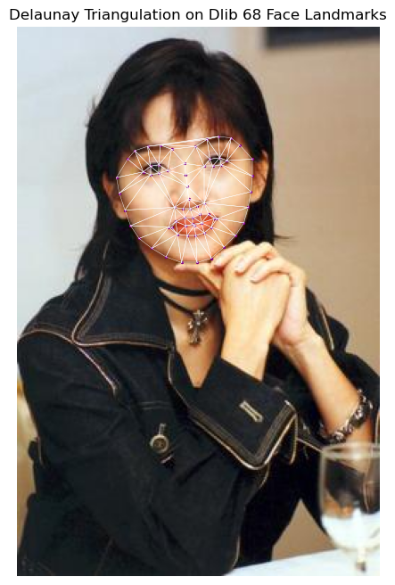

## 1. 什么是 Delaunay 三角剖分？

**Delaunay 三角剖分** (Delaunay Triangulation) 是一种在平面点集 $P$ 上的三角剖分 $DT(P)$，它满足一个关键属性：在剖分中的任何三角形的外接圆内，不包含 $P$ 中的任何其他点。这种剖分最大化了三角形的最小内角，避免了出现“又瘦又长”的三角形，使得结果更加稳定和均匀，在计算机图形学和图像处理中应用广泛，特别是对于人脸变形（Face Morphing）技术至关重要。

## 2. 准备工作

-   libs
    -   `dlib`
    -   `opencv-python`
    -   `numpy`
    -   `matplotlib`

## 3. 核心代码

### 3.1 获取 68 关键点

使用 `dlib` 的检测器和预测器提取人脸上的 68 个关键点坐标。

```python
import cv2
import dlib
import numpy as np
import matplotlib.pyplot as plt

# --- 模型加载与初始化 ---

# 1. 人脸检测器 (Face Detector)
# 使用 dlib 的 get_frontal_face_detector() 加载基于 HOG（Histogram of Oriented Gradients）
# 和线性分类器的默认人脸检测器。它的作用是找到图像中可能存在人脸的矩形区域。
detector = dlib.get_frontal_face_detector()

# 2. 关键点预测器 (Landmark Predictor)
# 加载 dlib 训练好的 68 点人脸关键点模型。
# 这个模型基于人脸检测器找到的矩形区域，预测 68 个预定义的特征点（如眼睛、鼻子、嘴巴的轮廓点）。
# 需要一个名为 "shape_predictor_68_face_landmarks.dat" 的文件，该文件包含预训练的模型权重。
predictor = dlib.shape_predictor("shape_predictor_68_face_landmarks.dat")

def get_landmarks(img):
    """
    使用 dlib 模型检测图像中的第一张人脸，并提取其 68 个关键点坐标。

    参数:
        img (np.ndarray): 输入的彩色图像（OpenCV BGR 格式）。

    返回:
        np.ndarray or None: 
            如果检测到人脸，返回一个形状为 (68, 2) 的 NumPy 数组，数据类型为 np.int32。
            每行包含一个关键点的 (x, y) 坐标。
            如果未检测到人脸，返回 None。
    """
    # 1. 预处理：灰度化
    # 将 BGR 图像转换为灰度图。人脸检测器和关键点预测器通常在灰度图上运行更高效。
    gray = cv2.cvtColor(img, cv2.COLOR_BGR2GRAY)
    
    # 2. 人脸检测
    # 使用检测器在灰度图上寻找人脸。它返回一个 dlib.rectangles 对象列表。
    # 每个 dlib.rectangle 对象定义了一个人脸的边界框。
    faces = detector(gray)
    
    # 3. 检查是否检测到人脸
    if not faces:
        # 如果列表为空，表示没有检测到人脸，直接返回 None。
        print("未检测到人脸。")
        return None

    # 4. 关键点预测
    # 仅对检测到的第一张人脸 (faces[0]) 进行关键点预测。
    # predictor 需要灰度图像和人脸边界框作为输入。
    # landmarks 是一个 dlib.full_object_detection 对象，包含了 68 个点的坐标。
    landmarks = predictor(gray, faces[0])
    
    # 5. 提取并格式化关键点坐标
    points = []
    # dlib 模型返回 68 个关键点，索引范围从 0 到 67。
    for i in range(68):
        # landmarks.part(i) 返回第 i 个关键点的 dlib.point 对象。
        # .x 和 .y 属性获取该点的 x 和 y 坐标。
        # 使用 int() 确保坐标是整数。
        x = landmarks.part(i).x
        y = landmarks.part(i).y
        points.append((int(x), int(y)))
        
    # 6. 转换为 NumPy 数组并返回
    # 将列表转换为 NumPy 数组，这是处理几何变换和数学运算的标准格式。
    # 确保数据类型为 32 位整数 (np.int32)。
    return np.array(points, dtype=np.int32)
```

### 3.2 Delaunay 三角剖分算法

通过使用 OpenCV 的 `Subdiv2D` 类来计算 Delaunay 三角形列表。这种剖分能确保生成的三角形更加匀称、稳定。

```python
import cv2
import numpy as np

def delaunay_triangulation(img_shape, points):
    """
    对关键点执行 Delaunay 剖分（Delaunay Triangulation），返回构成每个三角形的
    关键点在输入列表 `points` 中的索引三元组。

    Delaunay 剖分将点集划分为不重叠的三角形，并满足“空圆”特性：
    没有点集中的点位于任何三角形的外接圆内部。

    参数:
        img_shape (tuple): 图像的形状 (height, width, channels)，用于定义剖分区域。
        points (np.ndarray): 包含关键点的 N x 2 数组（或类似列表），每个元素是 (x, y) 坐标。

    返回:
        list: 包含有效三角形的关键点索引三元组 (ind1, ind2, ind3) 的列表。
              这些索引对应于输入 `points` 列表中的点。
    """
    # 1. 初始化 Delaunay 剖分对象
    height, width, _ = img_shape
    # 定义包含所有关键点的矩形区域。剖分将在该矩形内进行。
    rect = (0, 0, width, height)
    # 创建 Subdiv2D 对象，这是 OpenCV 中用于执行 Delaunay 剖分和 Voronoi 图计算的类。
    subdiv = cv2.Subdiv2D(rect)
    
    # 2. 插入点
    # 将所有关键点逐个插入到 Subdiv2D 结构中，构建 Delaunay 剖分。
    for p in points:
        # 强制转换为整数坐标进行插入，尽管 Subdiv2D 内部使用浮点数。
        # OpenCV 的 Subdiv2D 接受 (float, float) 或 (int, int) 坐标。
        subdiv.insert((int(p[0]), int(p[1])))

    # 3. 获取三角形列表 (坐标形式)
    # 获取 Delaunay 剖分结果中的所有三角形的顶点坐标列表。
    # 结果是一个 N x 6 的 NumPy 数组，每行包含 (x1, y1, x2, y2, x3, y3) 六个坐标。
    triangleList = subdiv.getTriangleList()
    triangles_indices = []
    
    # 4. 定义辅助函数：查找点的原始索引
    def index_of_point(pt):
        """
        查找给定坐标点在原始关键点列表 `points` 中的索引。

        参数:
            pt (np.ndarray): 待查找的点的 (x, y) 坐标，通常是 Subdiv2D 返回的顶点之一。

        返回:
            int: 原始点列表中的索引。如果找不到匹配的点，返回 -1。
        """
        # Subdiv2D 在计算中会引入极小的浮点误差，因此返回的顶点坐标可能与原始输入坐标略有不同。
        # 这里使用**近似比较**（基于最小距离）来查找原始点索引。
        # 计算给定点 `pt` 与原始点集 `points` 中所有点的欧氏距离的平方。
        # `points` 的形状是 (N, 2)，`pt` 的形状是 (2,)。
        # 使用 `(points - pt)**2` 进行逐元素差值的平方，`axis=1` 沿着行的方向求和。
        distances = np.sum((points - pt)**2, axis=1)
        
        # 检查最小距离是否在一个小的容忍范围内（例如小于 1.0 像素距离的平方）。
        # 如果最近的点足够接近，则认为它就是原始输入点之一。
        if np.min(distances) < 1.0: # 容忍距离小于1个像素的误差 (1^2 = 1.0)
            # 返回距离最小的点的索引
            return np.argmin(distances)
        # 如果没有找到足够接近的原始点，说明这个顶点可能是由剖分区域边界上的虚拟点生成的。
        return -1

    # 5. 遍历三角形列表，并转换为点的索引
    for t in triangleList:
        # 将六个坐标 (x1, y1, x2, y2, x3, y3) 重塑为 3 x 2 的数组 [(x1, y1), (x2, y2), (x3, y3)]。
        pts = t.reshape(-1, 2)
        # 提取三个顶点坐标
        p1, p2, p3 = pts[0], pts[1], pts[2]

        # 查找每个顶点在原始关键点列表 `points` 中的索引
        # 注意：在进行距离比较前，将 Subdiv2D 返回的浮点坐标转换为整数，
        # 虽然 `index_of_point` 内部会处理浮点误差，但对于基于像素的操作，转换为整数更稳健。
        # Subdiv2D 返回的坐标是 float32。
        ind1 = index_of_point(p1.astype(np.int32))
        ind2 = index_of_point(p2.astype(np.int32))
        ind3 = index_of_point(p3.astype(np.int32))

        # 6. 过滤并存储有效三角形
        # 仅保留所有三个顶点都在原始输入关键点列表中的有效三角形。
        # 索引为 -1 表示该顶点是边界上的虚拟点，并非原始关键点。
        if ind1 != -1 and ind2 != -1 and ind3 != -1:
            # 存储由原始关键点索引构成的三元组
            triangles_indices.append((ind1, ind2, ind3))
            
    return triangles_indices
```

### 3.3 Matplotlib 可视化结果

```python
def visualize_delaunay(img, points, triangles_indices):
    """
    使用 Matplotlib 绘制图像、关键点和三角形网格。

    参数:
    img (numpy.ndarray): 原始图像，通常是 OpenCV 读取的 BGR 格式。
    points (numpy.ndarray): 关键点坐标数组，形状为 (N, 2)，其中 N 是关键点数量 (如 68)。
    triangles_indices (list/numpy.ndarray): 每个三角形的顶点索引列表，
                                            例如 [[idx1, idx2, idx3], [idx4, idx5, idx6], ...]
    """
    
    # 将 BGR 格式的图像转换为 RGB 格式以在 Matplotlib 中正确显示
    # OpenCV (cv2) 默认读取的颜色通道顺序是 BGR (蓝绿红)，而 Matplotlib 默认期望 RGB (红绿蓝)。
    img_rgb = cv2.cvtColor(img, cv2.COLOR_BGR2RGB)
    
    # plt.figure(figsize=(10, 8))
    # 创建一个新的 Figure（画布）对象，并设置其大小为宽 10 英寸，高 8 英寸。
    plt.figure(figsize=(10, 8))
    
    # 1. 显示图像
    plt.imshow(img_rgb)
    # 在当前 Figure 的 Axes（坐标系）上显示 RGB 格式的图像。
    
    # 2. 绘制 68 个关键点
    # plt.scatter(x, y, s=size, c=color, marker=style, label=legend_text)
    plt.scatter(
        points[:, 0], # X 坐标：points 数组的第一列
        points[:, 1], # Y 坐标：points 数组的第二列
        s=2,         # 点的大小 (size)，设置为 10
        c='purple',      # 点的颜色 (color)，设置为红色
        marker='o',   # 点的形状 (marker)，设置为圆形
        label='Landmarks' # 为这些点设置图例标签
    )
    
    # 3. 绘制三角形边
    for tri in triangles_indices:
        # tri 是一个包含三个关键点索引的列表，例如 [17, 21, 22]。
        
        # 获取三角形的三个顶点坐标
        # points[索引] 从关键点数组中取出实际的 (x, y) 坐标
        p1 = points[tri[0]]
        p2 = points[tri[1]]
        p3 = points[tri[2]]

        # 将三个点连接起来，绘制三角形的三条边
        # plt.plot([x1, x2], [y1, y2], '格式字符串', linewidth=宽度)
        
        # 绘制 p1 到 p2 的边
        # 'b-' 是格式字符串，'b' 表示蓝色 (blue)，'-' 表示实线 (solid line)
        plt.plot([p1[0], p2[0]], [p1[1], p2[1]], 'w-', linewidth=0.3)
        
        # 绘制 p2 到 p3 的边
        plt.plot([p2[0], p3[0]], [p2[1], p3[1]], 'w-', linewidth=0.3)
        
        # 绘制 p3 到 p1 的边
        plt.plot([p3[0], p1[0]], [p3[1], p1[1]], 'w-', linewidth=0.3)

    plt.title("Delaunay Triangulation on Dlib 68 Face Landmarks")
    # 设置图表的总标题。
    
    plt.axis('off') 
    # 关闭坐标轴、刻度线和刻度标签。这通常用于图像处理，使图像本身成为焦点。
    
    plt.show()
    # 显示已创建的 Figure（画布）。
```



通过上述步骤，可以成功地将人脸 68 点转化为一个稳定的**三角网格**。这个网格是进行**人脸变形 (Face Morphing)** 和**图像混合 (Image Blending)** 的关键数据结构，后续只需对网格内的每个三角形执行**仿射变换**即可实现各种人脸图像编辑效果。

