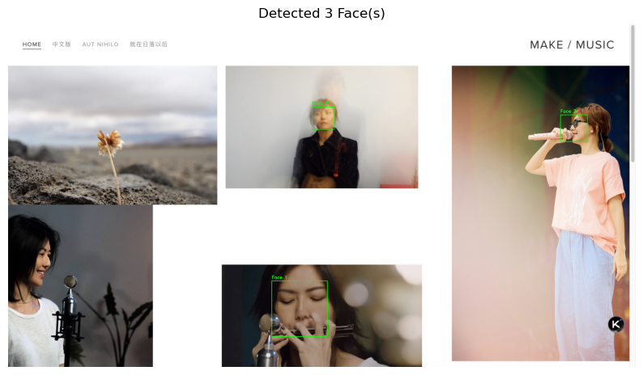

dlib 是一个现代化的 C++ 工具包，包含了机器学习算法和数据结构。它以其高质量和易用性而闻名，其内置的人脸检测器性能非常出色。

dlib 提供了一个基于 **HOG (Histogram of Oriented Gradients，梯度方向直方图)** 特征和线性分类器的经典人脸检测器，具有很高的检测精度。其接口设计得非常直观，几行代码就能完成检测任务。C++ 的底层也实现保证了运行速度快。

下面的脚本使用 dlib 默认的 HOG 人脸检测器。


（[图片来源](https://www.makemusic.sg/)）

```python
import dlib
import cv2
import matplotlib.pyplot as plt

def detect_faces_dlib(img_path):
    # 1. 初始化人脸检测器
    # dlib.get_frontal_face_detector() 返回一个预训练的HOG人脸检测器
    detector = dlib.get_frontal_face_detector()

    # 2. 加载图像
    # dlib 可以直接处理 numpy 数组（通过 OpenCV 读取的图像）
    img = cv2.imread(img_path)
    if img is None:
        print(f"无法加载图像: {image_path}")
        return

    # dlib 检测器要求输入灰度图或RGB图，更推荐RGB图
    # 图像必须是uint8类型
    
    # 3. 进行人脸检测
    # '1' 表示对图像进行一次上采样(upsample)，这有助于检测较小的人脸
    # 返回一个包含所有人脸矩形框的列表
    img_rgb = cv2.cvtColor(img, cv2.COLOR_BGR2RGB)
    dets = detector(img_rgb, 1)

    print(f"在图像中检测到 {len(dets)} 张人脸")

    # 4. 遍历检测结果并在图像上绘制矩形框
    for i, d in enumerate(dets):
        # 矩形框的坐标信息
        # d.left(), d.top(), d.right(), d.bottom()
        x1, y1, x2, y2 = d.left(), d.top(), d.right(), d.bottom()
        
        # 使用 OpenCV 绘制矩形框
        cv2.rectangle(img_rgb, (x1, y1), (x2, y2), (0, 255, 0), 2)
        cv2.putText(img_rgb, f"Face {i+1}", (x1, y1 - 10), cv2.FONT_HERSHEY_SIMPLEX, 0.7, (0, 255, 0), 2)

    # 5. 使用 Matplotlib 显示结果
    plt.figure(figsize=(10, 8))
    plt.imshow(img_rgb)
    plt.title(f"Detected {len(dets)} Face(s)")
    plt.axis('off')
    plt.show()

# 调用函数测试
detect_faces_dlib("stefanie-sun.jpg")
```



检测效果似乎没有那么完美，怎么没有检测出来燕姿女士在左下角的美丽侧脸呢🤷？