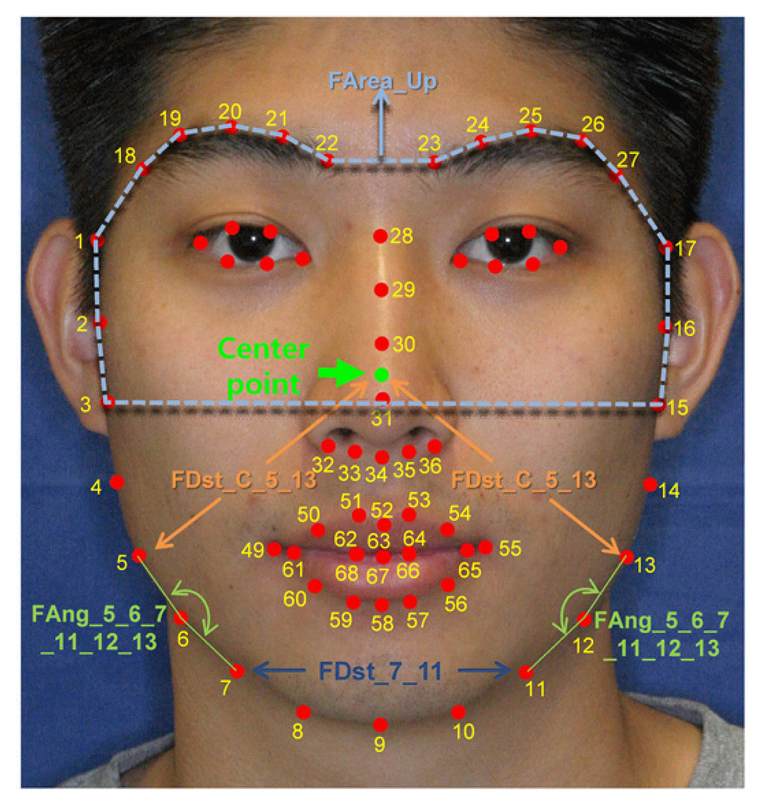
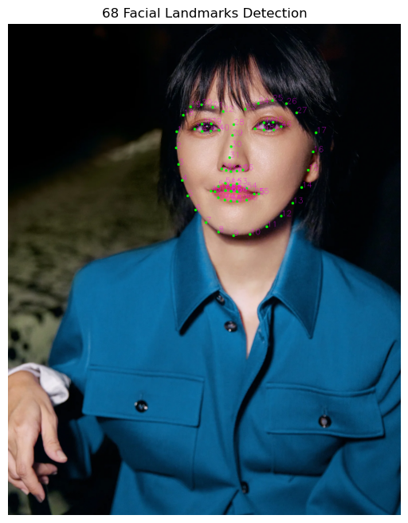

人脸关键点检测（Facial Landmark Detection）是计算机视觉领域的一个核心技术，它旨在识别和定位人脸上的重要特征点，例如眼睛、眉毛、鼻子和嘴巴的轮廓。

人脸68点检测提供了丰富的几何信息，是许多高级人脸应用的基础。

### 1. 什么是人脸68点？

人脸68点是指由一个被广泛接受的标准模型所定义的人脸上的68个特定坐标点。这些点覆盖了眼睛、眉毛、鼻子、嘴巴和下巴的轮廓，能够全面、精细地描绘出人脸的几何形状和表情特征。


（[图片来源](https://github.com/IS2AI/thermal-facial-landmarks-detection?tab=readme-ov-file#the-facial-landmarks-are-ordered-as-follows)）

这些点的典型分布如下：

-   **下巴轮廓:** 点 $1$ 到 $17$
-   **左眉:** 点 $18$ 到 $22$
-   **右眉:** 点 $23$ 到 $27$
-   **鼻子:** 点 $28$ 到 $36$
-   **左眼:** 点 $37$ 到 $42$
-   **右眼:** 点 $43$ 到 $48$
-   **嘴巴（外轮廓）:** 点 $49$ 到 $60$
-   **嘴巴（内轮廓）:** 点 $61$ 到 $68$



（[图片来源](https://www.jkom.org/journal/Figure.php?xn=jkm-42-4-102.xml&id=f3-jkm-42-4-102&number=5059&p_name=1159_5059)）

## 2. dlib的实现原理

dlib库实现人脸关键点检测主要依赖于一个强大的算法——**集合回归树（Ensemble of Regression Trees）**。

1.  **人脸检测 (Face Detection):** 在进行关键点检测之前，首先需要确定图像中**人脸的位置**。dlib 使用基于**最大边际结构化支持向量机（Max-Margin Object Detector, MMOD）** 或 **HOG（Histogram of Oriented Gradients）** 的检测器来快速准确地定位人脸框。
2.  **关键点预测 (Landmark Prediction):** 一旦人脸被定位，dlib 就会加载一个预训练的 **shape predictor 模型**（通常是 `shape_predictor_68_face_landmarks.dat`）。这个模型是一个集合回归树，它通过多阶段迭代，从一个粗略的形状估计开始，逐渐**收敛**到68个关键点的精确位置。

## 3. 准备工作

-   libs
    -   opencv-python
    -   dlib
    -   matplotlib
-   [`shape_predictor_68_face_landmarks.dat`](https://github.com/davisking/dlib-models/blob/master/shape_predictor_68_face_landmarks.dat.bz2/) 
    dlib 预训练的关键点检测模型

## 4. 代码实现


（[图片来源](https://www.makemusic.sg/new-index-3#/page-2/)）

```python
import cv2
import dlib
import matplotlib.pyplot as plt

# 1. 初始化 dlib 的检测器和预测器
# 人脸检测器 (Face Detector)
detector = dlib.get_frontal_face_detector() 
# 关键点预测器 (Landmark Predictor)
predictor = dlib.shape_predictor("shape_predictor_68_face_landmarks.dat") 

# 2. 读取图像
image = cv2.imread("stefanie-sun.jpg")
gray = cv2.cvtColor(image, cv2.COLOR_BGR2GRAY)

# 3. 检测人脸
# 返回一个包含人脸矩形框的列表
faces = detector(gray, 1)

# 4. 遍历检测到的每张人脸
for face in faces:
    # 预测关键点 (Shape Prediction)
    landmarks = predictor(gray, face)
    
    # 5. 绘制关键点
    # landmarks 是一个 dlib.full_object_detection 对象
    for i in range(0, 68):
        # 获取第 i 个点的 x, y 坐标
        x = landmarks.part(i).x
        y = landmarks.part(i).y
        
        # 在图像上绘制圆形点
        cv2.circle(image, (x, y), 5, (0, 255, 0), -1)
        # 添加点编号
        cv2.putText(image, str(i + 1), (x, y), cv2.FONT_HERSHEY_SIMPLEX, 1, (255, 0, 255), 1)

# 6. 使用 Matplotlib 显示结果
plt.figure(figsize=(10, 8))
plt.imshow(cv2.cvtColor(image, cv2.COLOR_BGR2RGB))
plt.title("68 Facial Landmarks Detection")
plt.axis('off')
plt.show()
```



