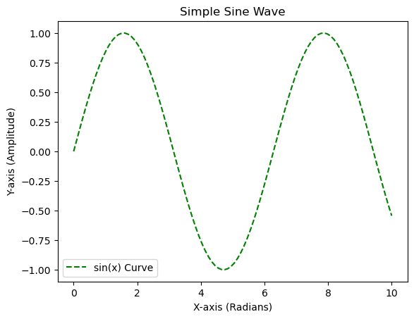
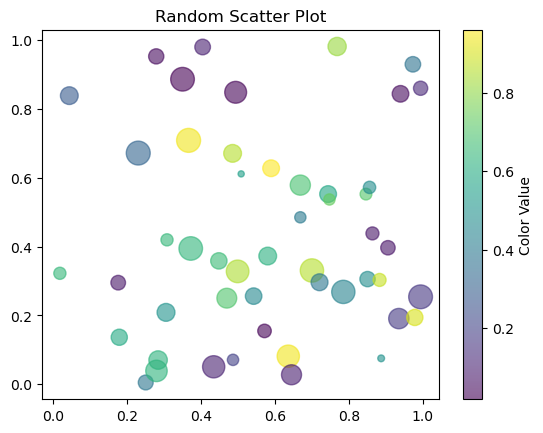

Matplotlib 是用 Python 制作图表的重要工具库。本文从 Matplotlib 的核心概念和最常用的接口 **`pyplot`** 模块入手，以掌握基础绘图的技能。

## 1. Matplotlib 是什么？

**Matplotlib** 是一个强大的 **Python 2D 绘图库**，它可以生成各种硬拷贝（如 PNG, PDF, SVG），也可以在跨平台交互式环境（如 Jupyter Notebook）中生成高质量图形。

在代码中，一般通过如下方式导入：

```python
import matplotlib.pyplot as plt
```

其中，**`matplotlib.pyplot`**（通常简写为 **`plt`**）是 Matplotlib 库中提供的一个模块，它提供了一种类似 MATLAB 的简单接口，用于创建图表。

## 2. Matplotlib 的核心组件

为了更好地控制图表的每一个元素，理解 Matplotlib 图形的层次结构至关重要。一张 Matplotlib 图形主要由以下四个核心组件构成：

| **组件名称** | **英文**   | **描述**                                                     | **常用操作**                                      |
| ------------ | ---------- | ------------------------------------------------------------ | ------------------------------------------------- |
| **画布**     | **Figure** | 整个图形的容器，可以把它想象成一张画纸。一张 Figure 可以包含一个或多个 Axes。 | `plt.figure()`                                    |
| **坐标系**   | **Axes**   | 图形中的**绘图区域**（注意区分 Axes 和 Axis）。**每个 Axes 都有自己的坐标轴、标题、标签等**。它是真正进行数据可视化的场所。 | `fig.add_subplot()`, `plt.subplot()`, `plt.gca()` |
| **坐标轴**   | **Axis**   | 坐标系（Axes）的组成部分，包括刻度线（ticks）和刻度标签（tick labels）。通常有 **X-Axis** 和 **Y-Axis**。 | `ax.set_xticks()`, `ax.set_xlabel()`              |
| **图元**     | **Artist** | 图形上的所有可见元素，包括线、点、文本、图例等。             | `plt.plot()`, `plt.scatter()`, `ax.text()`        |

简单来说：**一个 Figure (画布) 包含一个或多个 Axes (坐标系)，每个 Axes 都有 X 和 Y Axis (坐标轴)，以及各种 Artist (图元)。**

## 3. 使用 `pyplot` 快速绘图

在大多数入门和快速绘图的场景中，主要使用 `pyplot` 接口，因为它会自动管理 Figure 和 Axes 对象。

### 3.1 绘制折线图 (`plt.plot`)

`plt.plot()` 是最常用的函数，用于绘制线图或标记点。

```python
import matplotlib.pyplot as plt
# 导入 Matplotlib 的 pyplot 模块，并将其约定性地重命名为 plt。
# 这是进行快速、函数式绘图时最常用的接口。

import numpy as np
# 导入 NumPy 库，并将其约定性地重命名为 np。
# NumPy 用于进行高效的数值计算，这里用于生成数据。

# --- 准备数据部分 ---
x = np.linspace(0, 10, 100)
# 使用 NumPy 的 linspace 函数生成一组均匀间隔的数据点。
# 参数说明：
# 0: 起始值
# 10: 终止值（包含）
# 100: 在 [0, 10] 区间内生成的点的总数。
# 这组数据将作为折线图的 X 轴坐标。

y = np.sin(x)
# 计算 x 数组中每个元素的正弦值，生成对应的 Y 轴坐标数据。
# 这样 (x, y) 就构成了一个正弦波形。

# --- 绘制折线图部分 ---
# plt.plot(x, y, label='sin(x) Curve', color='green', linestyle='--')
# 调用 plt.plot() 函数来绘制折线图。
# 参数说明：
# x: X 轴数据 (x)
# y: Y 轴数据 (y)
# label: 'sin(x) Curve' (给这条曲线设置一个标签，用于在图例中显示)
# color: 'green' (设置线条的颜色为绿色)
# linestyle: '--' (设置线条的样式为虚线。常见的样式有 '-' 实线, '--' 虚线, ':' 点线, '-.' 点划线)
plt.plot(x, y, label='sin(x) Curve', color='green', linestyle='--')

# --- 添加图表元素部分 ---
plt.title("Simple Sine Wave")
# 设置当前 Axes（坐标系）的标题。

plt.xlabel("X-axis (Radians)")
# 设置 X 轴的标签文本。

plt.ylabel("Y-axis (Amplitude)")
# 设置 Y 轴的标签文本。

plt.legend()
# 显示图例 (Legend)。图例根据 plt.plot() 函数中设置的 label 值自动生成，
# 用于识别图表中不同线条或数据系列的含义。

plt.show()
# 显示所有已创建的 Matplotlib Figure（画布）。
# 这是将图形渲染到屏幕上或交互式环境（如 Jupyter Notebook）的最终步骤。
```



### 3.2 绘制散点图 (`plt.scatter`)

散点图非常适合显示数据点的分布。

```Python
import matplotlib.pyplot as plt
import numpy as np

# --- 准备数据部分 ---
# np.random.seed(42)
# 设置 NumPy 随机数生成器的种子为 42。
# 这样做是为了确保每次运行代码时，生成的随机数序列都是相同的，
# 从而保证图表的可复现性。

data_x = np.random.rand(50)
# 使用 NumPy 生成 50 个 0 到 1 之间均匀分布的随机浮点数，作为散点的 X 轴坐标。

data_y = np.random.rand(50)
# 生成 50 个 0 到 1 之间的随机浮点数，作为散点的 Y 轴坐标。

size = np.random.randint(20, 300, 50)
# 生成 50 个在 20 到 300 之间（不包含 300）的随机整数，作为散点图中的每个点的大小 (s)。
# 这样图中的点会呈现出不同的大小。

colors = np.random.rand(50)
# 生成 50 个 0 到 1 之间的随机浮点数。这些值将被用来决定每个散点的颜色 (c)。
# Matplotlib 会将这些数值映射到指定的颜色映射表 (cmap) 上。

# --- 绘制散点图部分 ---
# plt.scatter(x, y, s=size, c=colors, alpha=0.6, cmap='viridis')
# 调用 Matplotlib 的 pyplot 模块中的 scatter 函数来绘制散点图。
# 参数说明：
# x: data_x (X 轴坐标)
# y: data_y (Y 轴坐标)
# s: size (每个点的大小，实现了散点的“气泡”效果)
# c: colors (每个点的颜色值)
# alpha: 0.6 (点的透明度，取值范围 0.0-1.0。0.6 表示半透明，有助于观察点的重叠情况)
# cmap: 'viridis' (指定颜色映射表。'viridis' 是一种常用的、感知均匀的颜色方案)
plt.scatter(data_x, data_y, s=size, c=colors, alpha=0.6, cmap='viridis')

# 添加颜色条，便于理解颜色映射
plt.colorbar(label='Color Value')
# 添加一个颜色条 (Colorbar) 到图表的侧边。
# 颜色条用于展示 c 参数 (colors) 的数值是如何映射到实际颜色的。
# label='Color Value' 设置了颜色条的标签。

plt.title("Random Scatter Plot")
# 设置当前 Axes（坐标系）的标题。

plt.show()
# 显示所有已绘制的 Matplotlib Figure（画布）。
# 如果在非交互式环境中运行，这一行是必需的。
```



