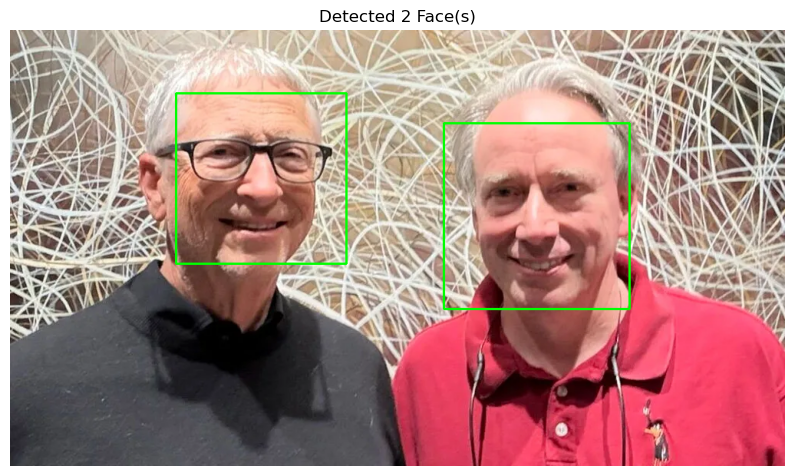

# 基于Haar级联分类器的人脸识别

人脸检测是计算机视觉的入门砖。

## 1. 准备工作

-   libs
    -   opencv-python
    -   matplotlib
-   `haarcascade_frontalface_default.xml`
    -   核心是 OpenCV 提供的 **Haar 级联分类器**。它是一种高效的目标检测方法，依赖于预先训练好的 XML 文件来识别图像中的人脸特征。

## 2. 人脸检测与可视化


（[图片来源](https://www.tomshardware.com/software/operating-systems/long-time-rivals-bill-gates-and-linus-torvalds-meet-for-the-first-time-have-dinner-no-major-kernel-decisions-were-made-but-maybe-next-dinner)）

下述脚本使用 OpenCV，首先将图像加载为灰度图进行检测，并在彩色图像上绘制矩形，最后使用 Matplotlib 显示结果。

```python
import cv2
import sys
import matplotlib.pyplot as plt

# 1. 配置路径
cascade_path = 'haarcascade_frontalface_default.xml'
image_path = 'faces.jpg'

# 2. 加载模型与图像
face_cascade = cv2.CascadeClassifier(cascade_path)

if face_cascade.empty():
    print(f"错误: 无法加载级联文件 {cascade_path}")
    sys.exit()

image = cv2.imread(image_path)
if image is None:
    print(f"错误: 无法加载图像 {image_path}")
    sys.exit()

# 3. 图像预处理
# OpenCV (BGR) 转 Matplotlib (RGB)
rgb_image = cv2.cvtColor(image, cv2.COLOR_BGR2RGB)
# 彩色图转灰度图，用于加速检测
gray_image = cv2.cvtColor(image, cv2.COLOR_BGR2GRAY) 

# 4. 执行人脸检测
faces = face_cascade.detectMultiScale(
    gray_image,
    scaleFactor=1.1,  # 图像缩小比例
    minNeighbors=5,   # 每个检测框保留所需的最小邻居数
    minSize=(30, 30)  # 最小检测尺寸
)

# 5. 绘制矩形
# 在 RGB 图像上圈出检测到的人脸
for (x, y, w, h) in faces:
    cv2.rectangle(rgb_image, (x, y), (x + w, y + h), (0, 255, 0), 2) 

# 6. 使用 Matplotlib 显示结果
plt.figure(figsize=(10, 8))
plt.imshow(rgb_image)
plt.title(f"Detected {len(faces)} Face(s)")
plt.axis('off')
plt.show()
```



## 3. 备注

1.   OpenCV 读取图像的默认颜色顺序是 BGR，而 Matplotlib 期望的是 RGB。
2.   `detectMultiScale` 是检测的核心。

-   `scaleFactor`: 越小，检测越精细，但速度越慢。
-   `minNeighbors`: 越大，假阳性越少（误报越少），但可能漏掉一些人脸。